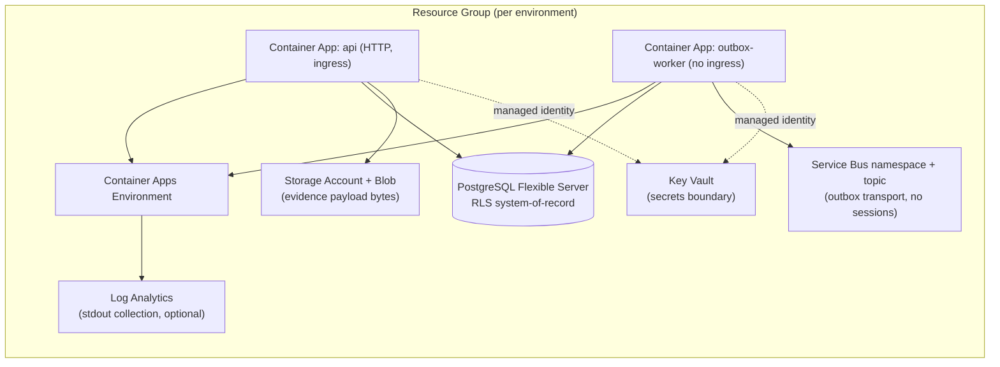

# Production Deployment Baseline (Azure)

> Status: **baseline / skeleton.** This document and the `infra/` tree describe the TARGET
> Azure shape for The House v2 and provide static validation tooling. They do **not** deploy
> live resources, require credentials, or change application runtime behavior. Real deployment
> (identity wiring, Key Vault secret population, networking hardening, CI/CD) is future work.

## Purpose

The House v2 has a strong governed backend (Governance Kernel FSM, RLS-enforced PostgreSQL
system-of-record, transactional outbox, evidence storage + malware/quarantine gate,
centralized authorization, vendor-neutral observability). What it lacked was a **deployable
shape on paper**: an environment model, an Infrastructure-as-Code skeleton, a config/secrets
matrix, and a static validation command. This pass adds exactly that — nothing is deployed.

## Target topology



- **API** and **outbox worker** are **separate** Container Apps so they scale and fail
  independently. The worker has **no ingress** (it is a background drainer). Container Apps is
  preferred over App Service precisely because it models two long-running processes cleanly.
- **PostgreSQL Flexible Server** is the durable, RLS-enforced system-of-record.
- **Service Bus** is the outbox transport (topic; **no sessions** in v1).
- **Storage Account / Blob** holds evidence payload **bytes** only; governance metadata stays
  in PostgreSQL.
- **Key Vault** is the secrets boundary; runtime reads secrets via **managed identity**
  (future pass).
- **Log Analytics** optionally collects stdout. Telemetry remains **vendor-neutral**; there is
  no hard dependency on Application Insights or any vendor SDK.

### Trade-off: Container Apps vs App Service

| | Azure Container Apps (chosen) | Azure App Service |
| --- | --- | --- |
| Separate API + worker processes | Natural (two apps, independent scale) | Awkward (WebJobs / second plan) |
| Scale-to-zero / KEDA | Built-in | Limited |
| Container-first | Yes | Yes (Linux containers) |
| Simplicity for a single web app | Slightly more setup | Slightly simpler |

The worker/API split is the deciding factor, so the baseline uses Container Apps. App Service
remains a valid alternative for an API-only deployment.

## Environment model

| Environment | `APP_ENV` | Purpose | Notes |
| --- | --- | --- | --- |
| `local` | `local` | Developer laptop | `memory`/`demo` defaults; no Azure required. |
| `dev` | `development` | Shared integration | Production-like fail-closed config. |
| `test` | `test` | Automated/QA | Production-like wiring, disposable data. |
| `prod` | `production` | Live | Strictest config; `demo` auth forbidden. |

`development`, `staging`, and `production` are **production-like** (`isProductionLikeEnv`) and
fail closed on missing required configuration. `local` and `test` are not.

## Config / secrets matrix

Secrets live in **Key Vault** (or platform secrets), never in `.env`, IaC, or parameter files.
The table classifies each value; **secret** values are delivered to the runtime as Container
Apps secrets sourced from Key Vault via managed identity (future pass).

| Variable | Class | local | dev/test | prod |
| --- | --- | --- | --- | --- |
| `NODE_ENV` | non-secret | `development` | `production` | `production` |
| `APP_ENV` | non-secret | `local` | `development`/`test` | `production` |
| `AUTH_MODE` | non-secret | `demo` | `entra_jwt` | `entra_jwt` (never `demo`) |
| `ENTRA_ISSUER` | non-secret | — | required | required |
| `ENTRA_AUDIENCE` | non-secret | — | required | required |
| `ENTRA_JWKS_URI` | non-secret | — | required | required |
| `DATABASE_URL` | **secret** | local PG | Key Vault | Key Vault |
| `MIGRATE_DATABASE_URL` | **secret** | local PG | Key Vault | Key Vault |
| `SERVICE_BUS_ENABLED` | non-secret | `false` | `true` | `true` |
| `SERVICE_BUS_CONNECTION_STRING` | **secret** | — | Key Vault | Key Vault |
| `SERVICE_BUS_TOPIC_NAME` | non-secret | — | `house-outbox` | `house-outbox` |
| `EVIDENCE_STORAGE_PROVIDER` | non-secret | `memory` | `azure_blob` | `azure_blob` |
| `EVIDENCE_BLOB_CONNECTION_STRING` | **secret** | — | Key Vault | Key Vault |
| `EVIDENCE_BLOB_CONTAINER_NAME` | non-secret | — | `evidence` | `evidence` |
| `EVIDENCE_MALWARE_SCANNING_MODE` | non-secret | `disabled` | `signature` | `signature` |
| `EVIDENCE_QUARANTINE_ENABLED` | non-secret | `true` | `true` | `true` |
| `OBSERVABILITY_ENABLED` | non-secret | `true` | `true` | `true` |
| `OBSERVABILITY_EXPORTER` | non-secret | `console` | `console` | `console` |
| `LOG_LEVEL` | non-secret | `info` | `info` | `info`/`warn` |

> No secret VALUES appear in this repository. `.env.example`, `infra/`, and the example
> `.bicepparam` files contain only names, non-secret toggles, and placeholders.

## Startup & migration order

Migrations run as a **separate step**, never on app startup:

1. **Provision infrastructure** (`infra/azure/main.bicep` + an environment parameter file).
2. **Populate Key Vault** secrets (DB URLs, Service Bus + Blob connection strings, PG admin
   password) out-of-band.
3. **Run database migrations** using `MIGRATE_DATABASE_URL` (privileged migration role):
   `npm run db:migrate`. This is a one-shot job, distinct from the app role.
4. **Start the API** Container App (connects as the NON-superuser, RLS-respecting app role).
5. **Start the outbox worker** Container App (drains the outbox; publishes after commit).

## Runtime process model

- **api** — HTTP server (`src/http/server.ts`). Liveness `GET /healthz`, readiness
  `GET /readyz` (bounded, tenant-agnostic `SELECT 1`). Connects as the RLS-respecting app role.
- **outbox-worker** — interval drainer (`scripts/outbox-worker.ts` → `OutboxWorkerRuntime`).
  Concurrency-safe leasing (`FOR UPDATE SKIP LOCKED`); publishes to Service Bus after commit.
  v1 uses **no** Service Bus sessions.

## Health / readiness expectations

| Endpoint | Meaning | Probe wiring |
| --- | --- | --- |
| `GET /healthz` | Liveness; shallow, no I/O | Container Apps liveness probe |
| `GET /readyz` | Readiness; bounded `SELECT 1` | Container Apps readiness probe |

## Rollback assumptions

- Container Apps keeps prior revisions; rollback = shift traffic to the previous healthy
  revision. Deploy API and worker revisions together when a migration changes shared contracts.
- Database migrations are **forward-only** in this baseline. A rollback that requires a schema
  change needs a new compensating migration — there is no automated down-migration.

## Backup assumptions

- PostgreSQL Flexible Server automated backups are enabled (7-day retention in the skeleton;
  raise for production). Point-in-time restore is the recovery mechanism.
- Blob storage uses soft-delete (30 days in the skeleton). Evidence bytes are hash-addressed
  and re-derivable only from the original upload, so blob durability matters.
- Key Vault uses soft-delete + purge protection.

## Known gaps (intentionally future)

- **Managed identity** runtime binding to Key Vault / Storage / Service Bus is **not** wired;
  the skeleton documents it but injects only non-secret values.
- **Microsoft Entra app registration** (issuer/audience/app roles) is **adjacent** and not
  created by this IaC.
- **Private networking** (private endpoints, VNet integration, disabled public access) is
  future; the skeleton uses public access with platform auth and marks the hardening points.
- **CI/CD deployment** is out of scope; only a static, non-deploying validation workflow is
  provided (see `.github/workflows/deployment-baseline.yml`).
- **Cost/scale tuning, zone-redundant HA, DR/secondary region** are future.

## Validation

```sh
npm run deploy:check
```

Runs `scripts/validate-deployment-baseline.ts` (pure validator in
`src/deployment/validateDeploymentBaseline.ts`). It is **static**: it confirms the IaC files,
parameter files, doc, required `.env.example` variables, and the `deploy:check` script all
exist, and that **no secret-like values** or sport-specific terminology leak into `infra/`. It
never calls Azure, the `az` CLI, a database, or any network.
